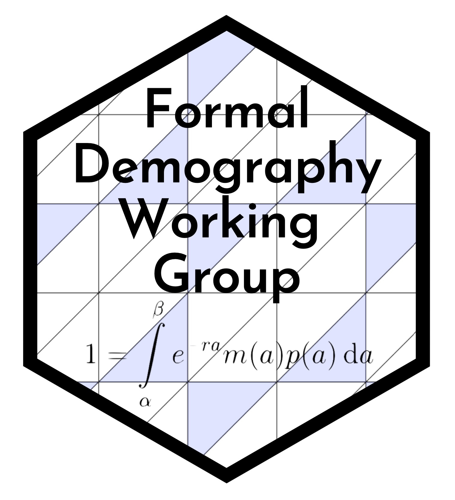

The Formal Demography Working Group aims to bring together formal demography scholars and those interested in formal demography to discuss recent and classic work, brainstorm new ideas, and to foster new collaborations. We aim to meet virtually roughly every month. Our specific aims are to:

1. Bring an international community of scholars together with formal demography as the focus 
2. Create a supportive and inclusive environment to learn, and encourage people to work with formal methods
3. Discuss the past, present and future of formal demography 

## Sign-up

If you would like to be included on the mailing list sign up [here](https://docs.google.com/forms/d/e/1FAIpQLSeacS7MDRaulnOsVW3fMX2qaMzFdqutMrYOj8N0E-NYA9c7KQ/viewform). 

# Next meeting

**Friday 21 April, 10am ET/4pm Rostock time**: [Riccardo Omenti](https://www.unibo.it/sitoweb/riccardo.omenti2/en) on estimating demographic quantities from crowdsourced online genealogies. 

Abstract:

> Crowdsourced online genealogies are a promising new data source for demographic analysis. This data source incorporates both individual-level demographic data, e.g. place and date of birth and/or death, as well as information about kinship ties that span over multiple centuries and countries. This presentation aims at illustrating new indicators to assess the overall quality of online genealogical data as well as at exploring the potential use of this data source to study the fertility transition in Northern Europe and North America during the historical period 1750-1900. The analysis relies on FamiLinx, a novel historical dataset crowdsourced from the public available genealogies on the website geni.com. The evolution of fertility is explored by constructing country-specific time series of total fertility rates (TFR) estimated using a novel Bayesian Statistical method developed by Schmertmann & Hauer (2019). Based upon the preliminary results of the analysis, the presentation will conclude with an overall critical assessment about the extent to which online genealogies can be used as an historical repository to document stylized facts from Demographic Theory.

## Register interest to present

If you are interested in presenting at a future meeting, fill out [this form](https://docs.google.com/forms/d/e/1FAIpQLSdscOmHFK7wmbazcBL54PkIAMvDiu6GnUMpmduYaM77T8rUFA/viewform).

## Contact

This working group is organized by [Vanessa Di Lego](http://www.wittgensteincentre.org/en/staff/member/di-lego.htm) (Vienna Institute of Demography), [Ryohei Mogi](https://ryomogi.github.io/) (University of Southern Denmark), and [Monica Alexander](https://www.monicaalexander.com/) (University of Toronto). We are always open to suggestions and feedback. 
