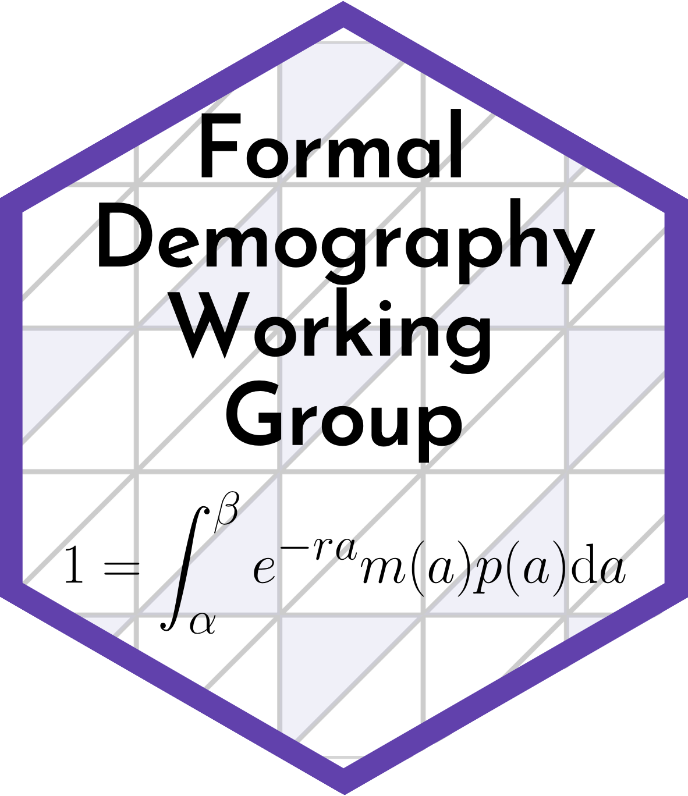

The Formal Demography Working Group aims to bring together formal demography scholars and those interested in formal demography to discuss recent and classic work, brainstorm new ideas, and to foster new collaborations. We aim to meet virtually roughly every month. Our specific aims are to:

1. Bring an international community of scholars together with formal demography as the focus 
2. Create a supportive and inclusive environment to learn, and encourage people to work with formal methods
3. Discuss the past, present and future of formal demography 

## Sign-up

If you would like to be included on the mailing list sign up [here](https://docs.google.com/forms/d/e/1FAIpQLSeacS7MDRaulnOsVW3fMX2qaMzFdqutMrYOj8N0E-NYA9c7KQ/viewform). 

# Next meeting

Stay tuned!

## Register interest to present

If you are interested in presenting at a future meeting, fill out [this form](https://docs.google.com/forms/d/e/1FAIpQLSdscOmHFK7wmbazcBL54PkIAMvDiu6GnUMpmduYaM77T8rUFA/viewform).

## Contact

This working group is organized by [Vanessa Di Lego](http://www.wittgensteincentre.org/en/staff/member/di-lego.htm) (Vienna Institute of Demography), [Ryohei Mogi](https://ryomogi.github.io/) (University of Southern Denmark), and [Monica Alexander](https://www.monicaalexander.com/) (University of Toronto). We are always open to suggestions and feedback. 
