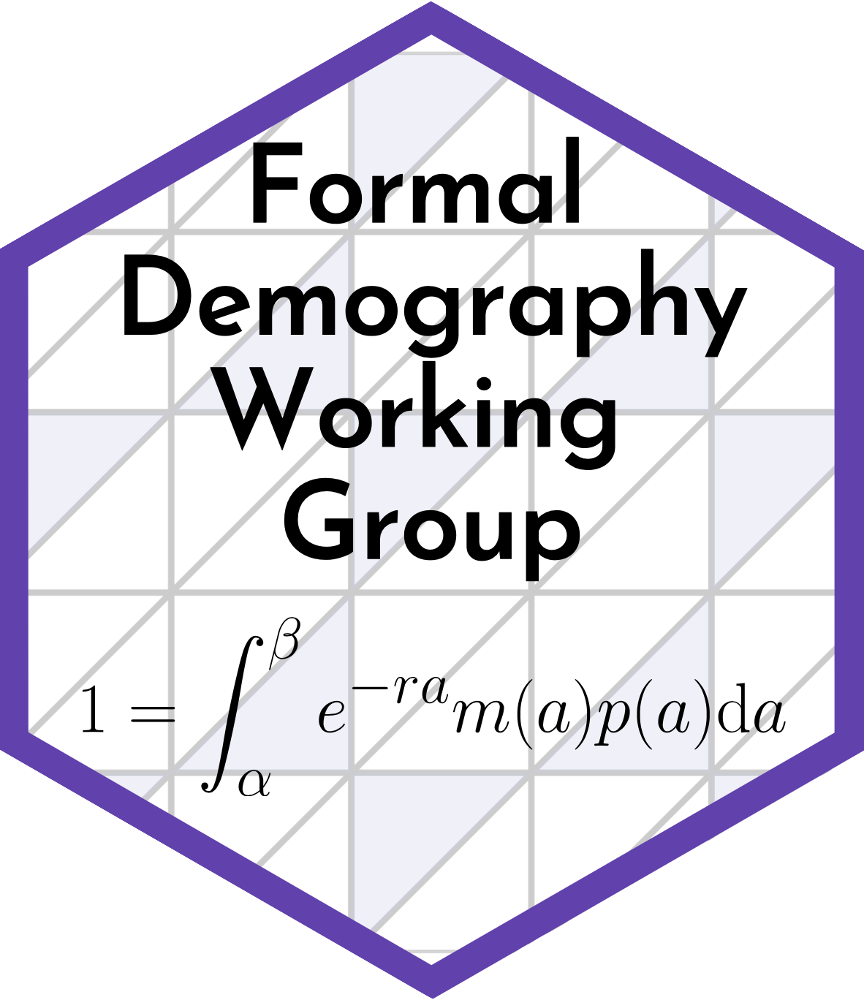

The Formal Demography Working Group aims to bring together formal demography scholars and those interested in formal demography to discuss recent and classic work, brainstorm new ideas, and to foster new collaborations. We aim to meet virtually roughly every month. Our specific aims are to:

1. Bring an international community of scholars together with formal demography as the focus 
2. Create a supportive and inclusive environment to learn, and encourage people to work with formal methods
3. Discuss the past, present and future of formal demography 

## Sign-up

If you would like to be included on the mailing list sign up [here](https://docs.google.com/forms/d/e/1FAIpQLSeacS7MDRaulnOsVW3fMX2qaMzFdqutMrYOj8N0E-NYA9c7KQ/viewform). 

# Next meeting

Our next meeting will be held on September 11 at 10am ET (4pm CET). [Philippe Bocquier](https://www.uclouvain.be/en/people/philippe.bocquier) will present **'Identifying small-area diffusion of mortality transitions using non-linear modelling in 19th-century Belgium'**. Sign up to receive Zoom details!

*Abstract*: Perhaps surprisingly, despite being regarded as a major concept in demography and a global phenomenon, the mortality transition has only recently been subjected to systematic comparison (Delventhal et al. 2021). By contrast, the fertility transition has been more extensively studied. A process of fertility diffusion, through the spread of knowledge and behaviour, has been identified in the early phase of the transition at both international and sub-national levels (Casterline 2001). This paper seeks to identify the mortality transition in nineteenth-century Belgium at a fine spatial scale, namely across almost 2,600 municipalities (median population: 1,004; IQR: 575–1,842), by combining single-exponential recursive smoothing of crude death rates with non-linear modelling to determine breakpoint years. Event history analysis of the transition years confirms the existence of a strong diffusion process, although the precise behavioural mechanism remains unclear.

## Register interest to present

If you are interested in presenting at a future meeting, fill out [this form](https://docs.google.com/forms/d/e/1FAIpQLSdscOmHFK7wmbazcBL54PkIAMvDiu6GnUMpmduYaM77T8rUFA/viewform).

## Contact

This working group is organized by [Vanessa Di Lego](https://vdilego.github.io/) (Federal University of Minas Gerais), [Ryohei Mogi](https://ryomogi.github.io/) (University of Southern Denmark and Pompeu Fabra University), and [Monica Alexander](https://www.monicaalexander.com/) (University of Toronto). We are always open to suggestions and feedback. 
